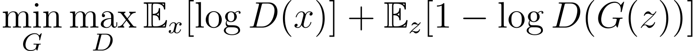
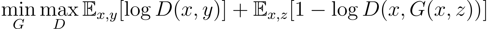
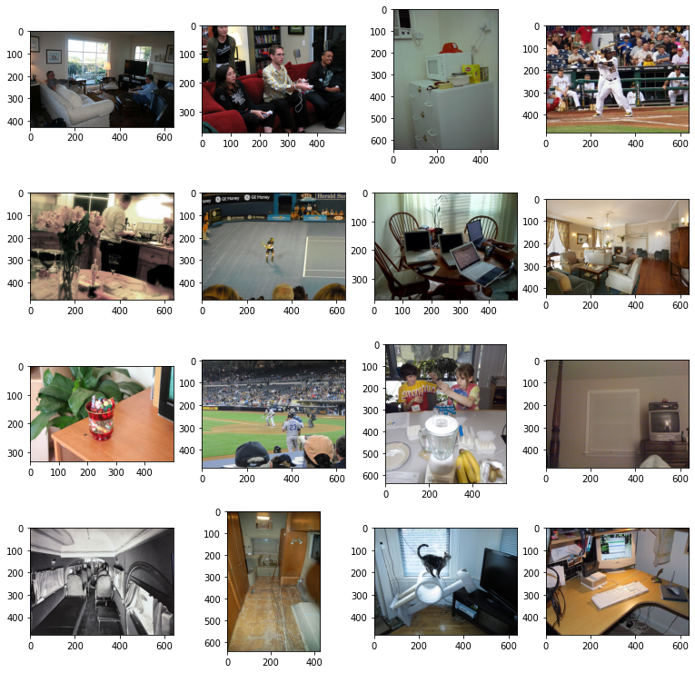
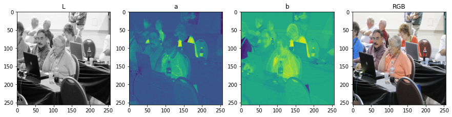
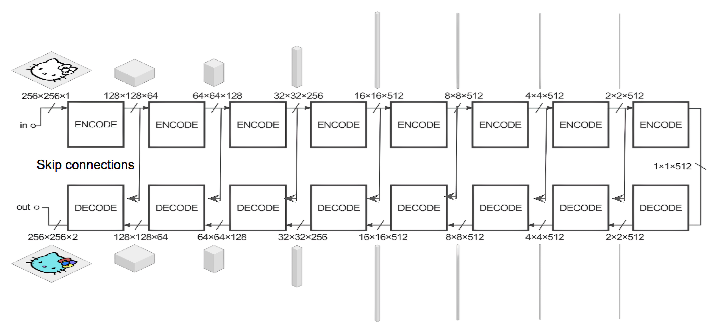

--------------------------------------------------------------------------------

# Colorizing black & white images with U-net and GANs <!-- omit in toc -->

## Table of Contents <!-- omit in toc -->
- [Overview of Project](#overview-of-project)
- [Prerequisite Theory](#prerequisite-theory)
  - [Image Spaces](#image-spaces)
  - [Generative Adversarial Networks](#generative-adversarial-networks)
- [Data Description](#data-description)
- [Dependencies](#dependencies)
- [Steps Followed](#steps-followed)
  - [Step 1. Importing Necessary Libraries](#step-1-importing-necessary-libraries)
  - [Step 2. Fetching The Dataset and Setting Up Input Paths](#step-2-fetching-the-dataset-and-setting-up-input-paths)
  - [Step 3. Defining Train and Test DataLoaders](#step-3-defining-train-and-test-dataloaders)
  - [Step 4. Modeling the Conditional GAN](#step-4-modeling-the-conditional-gan)
    - [4.1 Modelling the Generator](#41-modelling-the-generator)
    - [4.2 Modelling the Discriminator](#42-modelling-the-discriminator)
  - [Step 5. Defining Helper Functions](#step-5-defining-helper-functions)
  - [Step 6. Initializing The Model](#step-6-initializing-the-model)
  - [Step 7. Training](#step-7-training)
  - [Step 8. Visualizing Loss Trajectory](#step-8-visualizing-loss-trajectory)
    - [Generator Loss](#generator-loss)
    - [Discriminator Loss](#discriminator-loss)
    - [Average Generator Loss (Window size of 100)](#average-generator-loss-window-size-of-100)
    - [Average Discriminator Loss (Window size of 1000)](#average-discriminator-loss-window-size-of-1000)
  - [Step 9. Visualizing Predictions](#step-9-visualizing-predictions)
    - [Predictions on Training Data:](#predictions-on-training-data)
    - [Predictions on Validation Set:](#predictions-on-validation-set)
- [Conclusion](#conclusion)

## Overview of Project

Colorizing black and white images has always been a difficult task which required a lot of human input and hardcoding. But this gruesome task could be automated with the use of an end-to-end deep learning pipeline. The network can take a black and white image as an input, then produce a fully colored image as output.
Therefore, the final goal of this project is to colorize black and white images with the help of Conditional Generative Adversarial Networks (or CGANs).

Colorizing black and white images could be broadly categorized as an image to image translation task. Similar to language translation, we can have two different images relay the same information, hence one could be "translated" to the other. This image to image translation task has already been researched in a paper called <a href=https://arxiv.org/pdf/1611.07004.pdf>pix2pix Paper</a>, which again, uses Conditional GAN to fulfil the requirement.

## Prerequisite Theory

Before moving on to the description of model and results, let's first understand some basic things that are used throughout the project.

### Image Spaces

Since we are gonna be working with Black and white images, it is better to move the color space to L\*a\*b from RGB. This is because of two reasons:
* L\*a\*b space requires us to generate only two channels (*a and *b) using the L channel. Compare that with an RGB image, we can see that we are required to generate all three channels. This reduces the complexity of the network, hence reducing the training and testing time drastically.
* Also, it is easier to work with L\*a\*b images, simply because the input and output are very clearly divided where L is the input and \*a\*b is the output, which could be concatencated to produce the final image. No extra conversions are required, as compared to working with RGB image space.

For Comparison:

Read more on <a href="https://en.wikipedia.org/wiki/CIELAB_color_space">L\*a\*b here</a>

### Generative Adversarial Networks
Generative Adversarial Networks, or GANs are an approach that's used for unsupervised learning tasks. They are often the backbones of the cool, realistic images generated by A.I. 

<a href="https://www.nvidia.com/en-us/research/ai-demos/">Nvidia AI Demos</a>, <a href="https://this-person-does-not-exist.com/en">ThisPersonDoesNotExist</a>, <a href="https://huggingface.co/spaces/dalle-mini/dalle-mini">DALL.E mini</a>, <a href="https://www.youtube.com/watch?v=6E1_dgYlifc">StyleGAN2 Interpolation Loop</a> to name a few

Instead of going into the in-depth detail of how they work, i'll try to give an intuition around their working.

So, basically, a GAN consists of two 'bots' who compete against each other (hence the adversarial term) where one generates some data, and the other determines whether the generated data is real or fake.\
 Well, Let's take a simple problem. We ask the generator to generate an image of a tree. Then we take it's output and feed it to the discriminator, which determines whether it's real or fake. Initially, the generator produces random gibberish. But as the process goes on, both the generator and discriminator improves by learning from one another, as both of them are trying to increase the loss of the other, hence learning in the process. The final goal of the generator is to produce outputs that are "indistinguishable from reality". Hence, this forces the discriminator to guess with a probability of 0.5 whether the generated data is real or fake provided enough training is done and generator starts producing photorealistic outputs.

As per my understanding, this works because calculating the loss of a generator using traditional loss functions such as L1 or L2 loss are not sufficient to make sure the generator learns well enough to be able to create realistic results. Take the problem at hand, colorizing black and white images. If we train the generator with an L1 loss function instead of a discriminator, It is observed to produce subpar, blurry results (Source: Pix2Pix Paper).
Therefore, to capture the losses for such complex problems, we require a complex and variable method to calculate the loss, which is exactly what the discriminator is training for. It is basically training to judge the generator's output.

For a simple GAN, the loss function is defined as:

Here, we can see that the objective of the Generator (G) is to minimize right term, while the discriminator (D) Maximizes the left term.

In case of a conditional GAN, alongside some random noise "z", we provide conditional input "x" to allow the GAN to have some supervision. 

Hence, The loss Function becomes:

Where, x is the label for input data. For B/W to color task, x is the L channel of image, z is random noise and y is the concatencation of \*a\*b channels).

## Data Description
Since the task is simply colorization of black and white images, we don't need any specific labelled data. This allows us to use any image dataset containing various scenes for training. So i am using the COCO image dataset which contains various different images describing different objects and scenes. i used 8000 images for training and 2000 for testing.

The data is fetched using `fastai` Module. It makes it very easy to fetch and divide the dataset into train and test sets.

The dataset is defined in the following directory structure:
<pre>
.
└── .fastai
    └── data
        └── coco_sample
            └── train_sample
                └── *.jpg (10,000 images in total)
</pre>

## Dependencies

| **Name**     | **pip install Command**     |
| ------------ | --------------------------- |
| Numpy        | `pip install numpy`         |
| Matplotlib   | `pip install matplotlib`    |
| Torch        | `pip install torch`         |
| Torchvision  | `pip install torchvision`   |
| Glob         | `pip install glob2`         |
| PIL          | `pip install Pillow`        |
| Skimage      | `pip install scikit-image`  |
| tqdm         | `pip install tqdm`          |
| fastai       | `pip install fastai`        |
| TorchSummary | `pip install torch-summary` |

## Steps Followed

### Step 1. Importing Necessary Libraries
Getting all the required python libraries required for the implementation of the project, then defining the device to be used for calculations.

### Step 2. Fetching The Dataset and Setting Up Input Paths
Fetching the dataset using fastai (After installing and importing the module).Before defining training and validation paths, i am setting a seed of 123 to make sure that the fetched images are the same throughout different training sessions. Now, from that dataset, we fetch 10,000 images randomly using fastai.\
Then, these images are split randomly with 8,000 images to be used as training samples and 2,000 images for validation purpose.

Preview of the dataset:\
`['/root/.fastai/data/coco_sample/train_sample/000000051555.jpg'`\
 `'/root/.fastai/data/coco_sample/train_sample/000000533484.jpg'`\
 `'/root/.fastai/data/coco_sample/train_sample/000000134294.jpg'`\
 `...`\
 `'/root/.fastai/data/coco_sample/train_sample/000000128837.jpg'`\
 `'/root/.fastai/data/coco_sample/train_sample/000000164093.jpg'`\
 `'/root/.fastai/data/coco_sample/train_sample/000000333095.jpg']`

### Step 3. Defining Train and Test DataLoaders
Now the train dataset has 8000 images which can not be fed in one go. Therefore i define training and testing <a href="https://pytorch.org/tutorials/beginner/basics/data_tutorial.html">Dataloaders</a> with a batch size of 16 and 4 workers.\
Inside the dataloders, several preprocessing is done. the images are:
* Resized to 256x256 resolution
* Applying random horizontal flip (added after training for 350 epochs to see if results improve or not).
* Converted to L\*a\*b image space and values are normalized. 
* Now, these are split into `L_array and ab_array` having dimensions `1x256x256, 2x256x256` respectively.
I am shuffling both train and validation dataloaders.
Therefore, for a random element of train loader, we have:\
`L Array Shape : torch.Size([16, 1, 256, 256]) `\
`*a*b Array Shape : torch.Size([16, 2, 256, 256])`\
where, 16 is the batch size.

### Step 4. Modeling the Conditional GAN
#### 4.1 Modelling the Generator
Now comes the actual modelling part. i designed the generator according to what is defined in the pix2pix paper. So the generator is basically a U-Net with skip connections. It's architecture is as follows:

It has an encoding path and a decoding path. The architecture is difficult to code in one `class Generator(nn.Module)`. So I defined another `class GenBlock(nn.Module)` before hand as the U-NET uses many similar components over and over again.This helps in making the code concise and simple to read.\
The overall Generator summary is given below:

<pre>                                                                    <!-- omit in toc -->
----------------------------------------------------------------         <!-- omit in toc -->
        Layer (type)               Output Shape         Param #          <!-- omit in toc -->
================================================================         <!-- omit in toc -->
             Input-0          [16, 1, 256, 256]               0          <!-- omit in toc -->
            Conv2d-1         [16, 64, 128, 128]           1,024          <!-- omit in toc -->
         LeakyReLU-2         [16, 64, 128, 128]               0          <!-- omit in toc -->
         Gen_Block-3         [16, 64, 128, 128]               0          <!-- omit in toc -->
            Conv2d-4          [16, 128, 64, 64]         131,072          <!-- omit in toc -->
       BatchNorm2d-5          [16, 128, 64, 64]             256          <!-- omit in toc -->
         LeakyReLU-6          [16, 128, 64, 64]               0          <!-- omit in toc -->
         Gen_Block-7          [16, 128, 64, 64]               0          <!-- omit in toc -->
            Conv2d-8          [16, 256, 32, 32]         524,288          <!-- omit in toc -->
       BatchNorm2d-9          [16, 256, 32, 32]             512          <!-- omit in toc -->
        LeakyReLU-10          [16, 256, 32, 32]               0          <!-- omit in toc -->
        Gen_Block-11          [16, 256, 32, 32]               0          <!-- omit in toc -->
           Conv2d-12          [16, 512, 16, 16]       2,097,152          <!-- omit in toc -->
      BatchNorm2d-13          [16, 512, 16, 16]           1,024          <!-- omit in toc -->
        LeakyReLU-14          [16, 512, 16, 16]               0          <!-- omit in toc -->
        Gen_Block-15          [16, 512, 16, 16]               0          <!-- omit in toc -->
           Conv2d-16            [16, 512, 8, 8]       4,194,304          <!-- omit in toc -->
      BatchNorm2d-17            [16, 512, 8, 8]           1,024          <!-- omit in toc -->
        LeakyReLU-18            [16, 512, 8, 8]               0          <!-- omit in toc -->
        Gen_Block-19            [16, 512, 8, 8]               0          <!-- omit in toc -->
           Conv2d-20            [16, 512, 4, 4]       4,194,304          <!-- omit in toc -->
      BatchNorm2d-21            [16, 512, 4, 4]           1,024          <!-- omit in toc -->
        LeakyReLU-22            [16, 512, 4, 4]               0          <!-- omit in toc -->
        Gen_Block-23            [16, 512, 4, 4]               0          <!-- omit in toc -->
           Conv2d-24            [16, 512, 2, 2]       4,194,304          <!-- omit in toc -->
      BatchNorm2d-25            [16, 512, 2, 2]           1,024          <!-- omit in toc -->
        LeakyReLU-26            [16, 512, 2, 2]               0          <!-- omit in toc -->
        Gen_Block-27            [16, 512, 2, 2]               0          <!-- omit in toc -->
           Conv2d-28            [16, 512, 1, 1]       4,194,304          <!-- omit in toc -->
        LeakyReLU-29            [16, 512, 1, 1]               0          <!-- omit in toc -->
  ConvTranspose2d-30            [16, 512, 2, 2]       4,194,304          <!-- omit in toc -->
      BatchNorm2d-31            [16, 512, 2, 2]           1,024          <!-- omit in toc -->
          Dropout-32            [16, 512, 2, 2]               0          <!-- omit in toc -->
             ReLU-33            [16, 512, 2, 2]               0          <!-- omit in toc -->
        Gen_Block-34            [16, 512, 2, 2]               0          <!-- omit in toc -->
  ConvTranspose2d-35            [16, 512, 4, 4]       8,388,608          <!-- omit in toc -->
      BatchNorm2d-36            [16, 512, 4, 4]           1,024          <!-- omit in toc -->
          Dropout-37            [16, 512, 4, 4]               0          <!-- omit in toc -->
             ReLU-38            [16, 512, 4, 4]               0          <!-- omit in toc -->
        Gen_Block-39            [16, 512, 4, 4]               0          <!-- omit in toc -->
  ConvTranspose2d-40            [16, 512, 8, 8]       8,388,608          <!-- omit in toc -->
      BatchNorm2d-41            [16, 512, 8, 8]           1,024          <!-- omit in toc -->
          Dropout-42            [16, 512, 8, 8]               0          <!-- omit in toc -->
             ReLU-43            [16, 512, 8, 8]               0          <!-- omit in toc -->
        Gen_Block-44            [16, 512, 8, 8]               0          <!-- omit in toc -->
  ConvTranspose2d-45          [16, 512, 16, 16]       8,388,608          <!-- omit in toc -->
      BatchNorm2d-46          [16, 512, 16, 16]           1,024          <!-- omit in toc -->
             ReLU-47          [16, 512, 16, 16]               0          <!-- omit in toc -->
        Gen_Block-48          [16, 512, 16, 16]               0          <!-- omit in toc -->
  ConvTranspose2d-49          [16, 256, 32, 32]       4,194,304          <!-- omit in toc -->
      BatchNorm2d-50          [16, 256, 32, 32]             512          <!-- omit in toc -->
             ReLU-51          [16, 256, 32, 32]               0          <!-- omit in toc -->
        Gen_Block-52          [16, 256, 32, 32]               0          <!-- omit in toc -->
  ConvTranspose2d-53          [16, 128, 64, 64]       1,048,576          <!-- omit in toc -->
      BatchNorm2d-54          [16, 128, 64, 64]             256          <!-- omit in toc -->
             ReLU-55          [16, 128, 64, 64]               0          <!-- omit in toc -->
        Gen_Block-56          [16, 128, 64, 64]               0          <!-- omit in toc -->
  ConvTranspose2d-57         [16, 64, 128, 128]         262,144          <!-- omit in toc -->
      BatchNorm2d-58         [16, 64, 128, 128]             128          <!-- omit in toc -->
             ReLU-59         [16, 64, 128, 128]               0          <!-- omit in toc -->
        Gen_Block-60         [16, 64, 128, 128]               0          <!-- omit in toc -->
  ConvTranspose2d-61          [16, 2, 256, 256]           4,096          <!-- omit in toc -->
             Tanh-62          [16, 2, 256, 256]               0          <!-- omit in toc -->
================================================================         <!-- omit in toc -->
Total params: 54,409,856                                                 <!-- omit in toc -->
Trainable params: 54,409,856                                             <!-- omit in toc -->
Non-trainable params: 0                                                  <!-- omit in toc -->
----------------------------------------------------------------         <!-- omit in toc -->
Input size (MB): 4.00                                                    <!-- omit in toc -->
Forward/backward pass size (MB): 1871.38                                 <!-- omit in toc -->
Params size (MB): 207.56                                                 <!-- omit in toc -->
Estimated Total Size (MB): 2082.93                                       <!-- omit in toc -->
----------------------------------------------------------------         <!-- omit in toc -->
</pre>                                                                   <!-- omit in toc -->
Thus, as we can see, the input to the model is of shape `16x1x256x256` and output is of shape `16x2x256x256`.

#### 4.2 Modelling the Discriminator
The discriminator is usually a simple model which outputs a scalar value between 0 and 1 which is prediction score as to whether the input image is real or fake. But here, according to the pix2pix paper, it is better to use a PatchGAN instead, which penalizes structure at the scale of patches.\
This is advantageous because a smaller
PatchGAN has fewer parameters, runs faster, and can be
applied to arbitrarily large images.

The overall summary of the discriminator is given below:
<pre>                                                                    <!-- omit in toc -->
----------------------------------------------------------------         <!-- omit in toc -->
        Layer (type)               Output Shape         Param #          <!-- omit in toc -->
================================================================         <!-- omit in toc -->
             Input-0          [16, 3, 256, 256]               0          <!-- omit in toc -->
            Conv2d-1         [16, 64, 128, 128]           3,136          <!-- omit in toc -->
         LeakyReLU-2         [16, 64, 128, 128]               0          <!-- omit in toc -->
         DiscBlock-3         [16, 64, 128, 128]               0          <!-- omit in toc -->
            Conv2d-4          [16, 128, 64, 64]         131,072          <!-- omit in toc -->
       BatchNorm2d-5          [16, 128, 64, 64]             256          <!-- omit in toc -->
         LeakyReLU-6          [16, 128, 64, 64]               0          <!-- omit in toc -->
         DiscBlock-7          [16, 128, 64, 64]               0          <!-- omit in toc -->
            Conv2d-8          [16, 256, 32, 32]         524,288          <!-- omit in toc -->
       BatchNorm2d-9          [16, 256, 32, 32]             512          <!-- omit in toc -->
        LeakyReLU-10          [16, 256, 32, 32]               0          <!-- omit in toc -->
        DiscBlock-11          [16, 256, 32, 32]               0          <!-- omit in toc -->
           Conv2d-12          [16, 512, 31, 31]       2,097,152          <!-- omit in toc -->
      BatchNorm2d-13          [16, 512, 31, 31]           1,024          <!-- omit in toc -->
        LeakyReLU-14          [16, 512, 31, 31]               0          <!-- omit in toc -->
        DiscBlock-15          [16, 512, 31, 31]               0          <!-- omit in toc -->
           Conv2d-16            [16, 1, 30, 30]           8,193          <!-- omit in toc -->
        DiscBlock-17            [16, 1, 30, 30]               0          <!-- omit in toc -->
================================================================         <!-- omit in toc -->
Total params: 2,765,633                                                  <!-- omit in toc -->
Trainable params: 2,765,633                                              <!-- omit in toc -->
Non-trainable params: 0                                                  <!-- omit in toc -->
----------------------------------------------------------------         <!-- omit in toc -->
Input size (MB): 12.00                                                   <!-- omit in toc -->
Forward/backward pass size (MB): 1008.47                                 <!-- omit in toc -->
Params size (MB): 10.55                                                  <!-- omit in toc -->
Estimated Total Size (MB): 1031.02                                       <!-- omit in toc -->
----------------------------------------------------------------         <!-- omit in toc -->
</pre>                                                                   <!-- omit in toc -->

Thus, as we can see, the input to the discriminator is of shape `16x3x256x256` and output is of shape `16x1x30x30`.\
The output is basically a 30x30 matrix which is obtained after dividing the input image into 900 patches, which contains the predictions corresponding to each patch.

### Step 5. Defining Helper Functions

Here, i defined the following extra functions:
* `ShowSamples()`\
Used for showing and saving some samples while training the model. it takes a random batch from the input dataloader and passes it through the generator to get it's colorized predictions.

* `VisualizeLoss()`\
Used to plot the loss values w.r.t iterations performed during the training phase.

* `VisualizeAvgLoss()`\
Used to plot average loss values using sliding window technique. This allows us to see how the loss is changing. The average shows the trend very well. On the contrary, the accurate and sharp loss plot looks like as if it conveys no information, especially discriminator loss. So, i used a window size of 1000 for discriminator and 100 for generator to better capture loss trends.

### Step 6. Initializing The Model

The model hyperparameters are initialized here, along with functions for loading and saving checkpoints during training phase.
In each checkpoint, i am saving the state dictionary of generator, discriminator, their optimizers. I am also saving the number of epochs along with the loss values obtained thus far.
Also, while initializing the models, i am using Mixed Precision Training to (hopefully) speed up the training process.

### Step 7. Training

I performed forward propagation for a total of ~950 epochs. While training, i saved the loss values and some predictions on validation data.\
The training process was as follows:
* For the first ~50 epochs, i used google collab but it was very difficult to work with because it constantly disconnects, and the GPU use time is very limited. Therefore, i switched to kaggle instead.
* After that, the model was trained till ~350 epochs by taking breaks in between.
* As the loss was saturating at this point, i introduced random horizontal flips in the input datasets. This point is characterized by the sudden increase in generator loss near ~1,50,000 Iterations and sudden decrease in discriminator loss.
* Now, the model was trained till ~950 epochs.
* The loss nearly saturated again but this time, the average generator loss was higher than the loss observed at 350 epochs, when i started training again with random horizontal flips. It might possibly go down if i train further however. The results however seemed very similar to when the model was trained till 350 epochs.

### Step 8. Visualizing Loss Trajectory

#### Generator Loss

#### Discriminator Loss

As we can see, it is very difficult to get any meaningful information out of these accurate graphs. So, it is better to look at average loss values to better understand the trends.

#### Average Generator Loss (Window size of 100)

#### Average Discriminator Loss (Window size of 1000)

### Step 9. Visualizing Predictions

#### Predictions on Training Data:
As we can see, the predictions on test set are quite accurate, as they should be. But the story changes when we run it on Validation set.

#### Predictions on Validation Set:
As we can see, the predictions are acceptable but they are far from ideal. They are often washed out and in some instances, the generator is simply unable to color anything meaningful. So, there is definitely some scope of improvement.

## Conclusion
From the average loss graphs, we can clearly see how the generator loss reduces, slowly saturating (before 350 epochs), Similarly, the discriminator loss increases alongside, hence proving that the model was indeed learning from the learning data slowly.
After applying horizontal flips, the generator loss abruptly increases but it again slowly saturates, but this time, the final saturated loss value is relatively higher. This is expected as the model is easily able to overfit on training data if the data is kept the same throughout multiple train sessions.

From the results, we can see that the model is able to give very close predictions when predicting on training data, but the predictions are nowhere near perfect when using validation data. Hence, this model surely works, but it leaves a lot to be desired. The colors are often washed out, and sometimes we can see color patches in random areas which is very undesirable.

Using pretrained encoders like ResNet18 could increase the accuracy, which is something i am looking to implement in the near future.

Overall, this was an amazing project, i got to learn a lot while doing it, especially because this was the first time i worked with Pytorch and GANs in general.